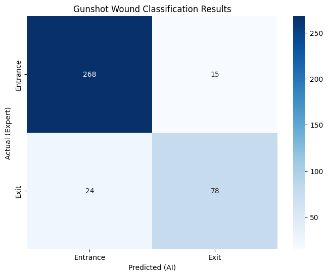
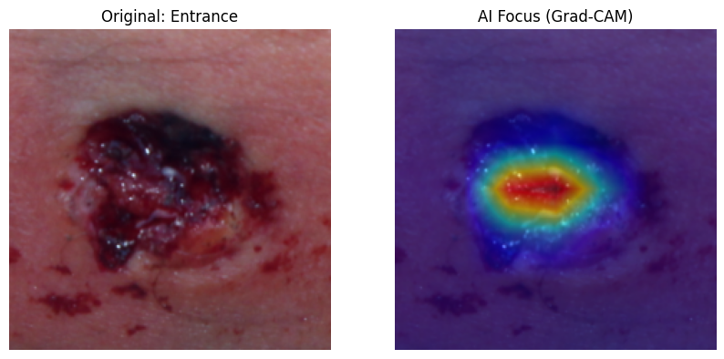

# Forensic Gunshot Wound Classification using ResNet50

## 🩺 1. Problem Definition & Objectives
Identifying the difference between **Entrance** and **Exit** gunshot wounds is a critical task in forensic pathology for reconstructing shooting incidents. This project explores the feasibility of utilizing deep learning models to assist pathologists in objectively distinguishing these wounds based on morphology. 

By leveraging the **ResNet50** architecture, this study aims to automate the detection of subtle pathological features, such as abrasion rings and skin tearing, to provide a second-opinion tool for forensic documentation.

## 📊 2. Dataset Specifications
The model was trained and evaluated using the **FDCPUnBGunshotDB**, a specialized forensic dataset provided by the University of Brasília.

* **Dataset Source:** [FDCPUnBGunshotDB GitHub](https://github.com/pedrogarciafreitas/FDCPUnBGunshotDB)
* **Classes & Distribution:**
  - **Entrance Wounds:** 1,883 images (Class 0)
  - **Exit Wounds:** 671 images (Class 1)
* **Data Split:** 70% Training / 15% Validation / 15% Test
* **Preprocessing:** Images were resized to 224x224 and normalized for ResNet50. Class imbalance was addressed using **Weighted Cross-Entropy Loss** (Ratio 1:2.8).

## 🚀 3. Key Technical Features
* **Automated Pipeline:** Custom `preprocess.py` script with a GUI to organize raw forensic data.
* **Architecture:** Transfer learning via **ResNet50** (ImageNet pre-trained weights).
* **Interpretability (XAI):** Integrated **Grad-CAM** to ensure the model focuses on clinically relevant wound margins.

## 📈 4. Performance Metrics (Results)
The model achieved robust performance on the unseen test set, demonstrating its potential as a diagnostic aid.

| Metric | Score |
| :--- | :--- |
| **Accuracy** | **90.1%** |
| **Precision (Entrance)** | **94.0%** |
| **Recall (Entrance)** | **95.0%** |
| **F1-Score (Entrance)** | **94.0%** |

*Note: The model shows high sensitivity in identifying entrance wounds, which is vital for forensic trajectory analysis.*

### Visual Analysis
#### A. Confusion Matrix

#### B. Model Interpretability (Grad-CAM)

*Grad-CAM visualization demonstrates that the model focuses on the **wound margin** and **surrounding tissue morphology**, aligning with standard forensic diagnostic criteria.*

## 🧑‍⚕️ About the Author
**Hee Jae Ryu, MD**
* Pathology Residency Applicant (2026 Match)
* Content Creator at 'CowEye' (1.68M+ Subscribers)
* Primary Interests: Digital Pathology & AI-driven Forensic Science
